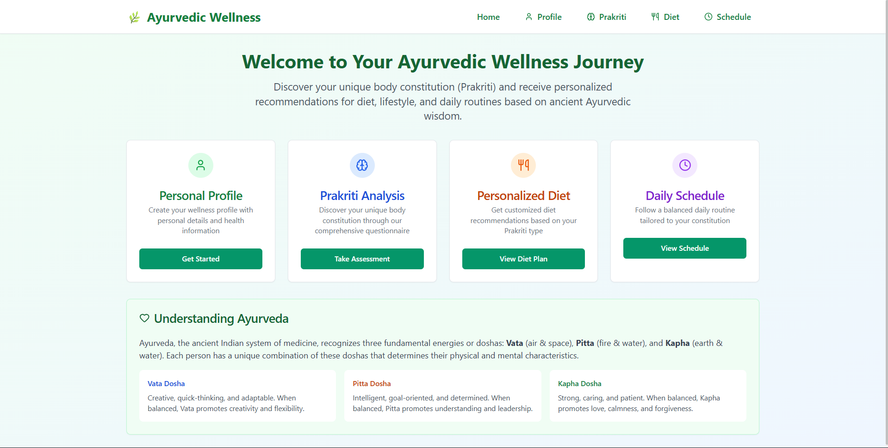
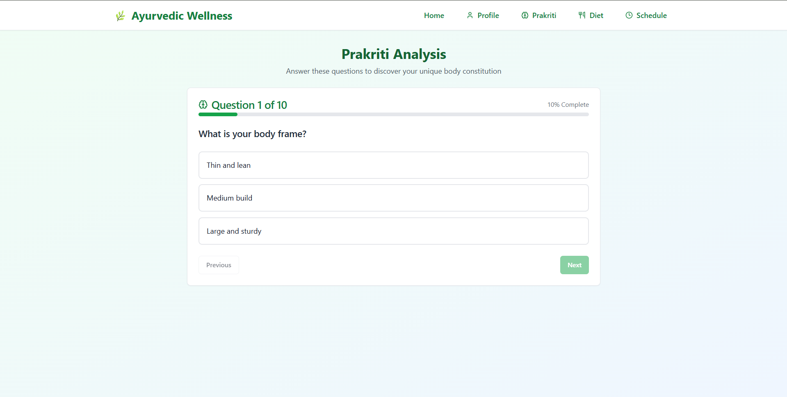
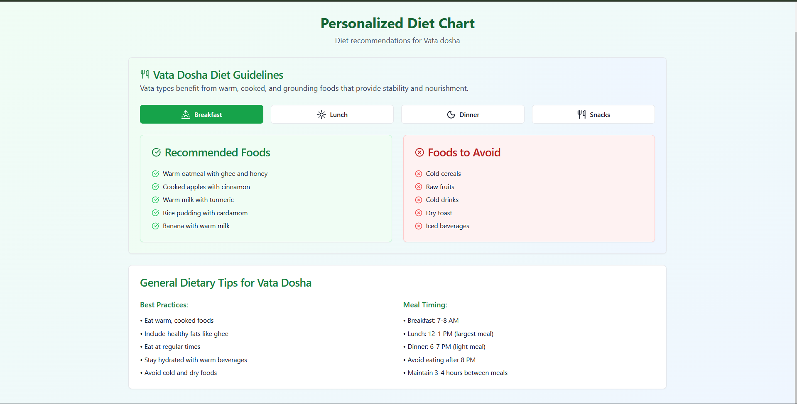
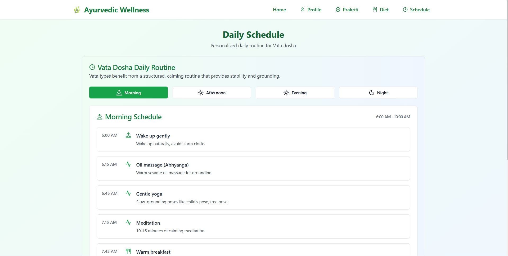
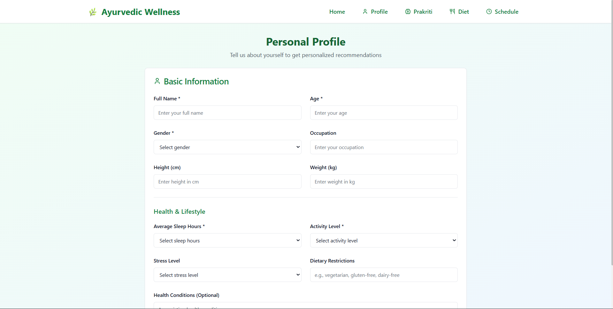
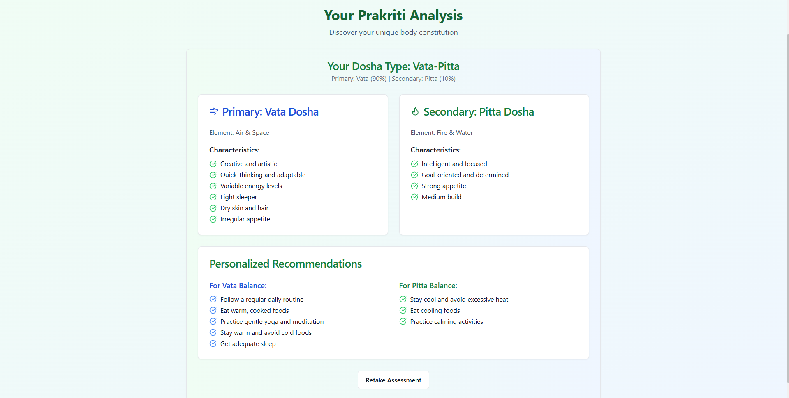

## Ayurvedic Wellness App

An intuitive React app that helps users explore Ayurvedic wellness through personalized prakriti analysis, tailored diet charts, daily routines, and a simple profile page. Built with modern React, lightweight UI components, and smooth responsive design.

### Features
- **Home dashboard**: Quick intro and navigation to all sections
- **User Profile**: Basic profile inputs for personalization
- **Prakriti Analysis**: Guided questionnaire and result view
- **Diet Chart**: Diet suggestions aligned with prakriti
- **Daily Schedule**: Day plan inspired by Ayurvedic practices
- **Responsive UI**: Mobile-friendly navigation and layouts

### Tech Stack
- **React 19** with **react-router-dom 7** for SPA routing
- **lucide-react** icons
- Lightweight UI primitives in `src/components/ui` (button, card, input, label, select)
- Bootstrapped with **Create React App**

---

## Getting Started

### Prerequisites
- Node.js 18+ and npm

### Installation
```bash
npm install
```

### Development
```bash
npm start
```
Visit `http://localhost:3000`.

### Tests
```bash
npm test
```

### Production build
```bash
npm run build
```
Outputs to the `build` directory.

---

## Available Scripts
- **start**: `react-scripts start`
- **build**: `react-scripts build`
- **test**: `react-scripts test`
- **eject**: `react-scripts eject` (irreversible)

---

## Application Routes
These routes are defined in `src/App.js`:
- `/` → `Home`
- `/profile` → `UserProfile`
- `/prakriti` → `PrakritiAnalysis`
- `/diet` → `DietChart`
- `/schedule` → `DailySchedule`

---

## Screenshots
Below are sample views located in `app_screenshots/`:








---

## Project Structure
```text
ayurvedic-wellness-app/
├─ public/
├─ src/
│  ├─ components/
│  │  ├─ Home.js
│  │  ├─ UserProfile.js
│  │  ├─ PrakritiAnalysis.js
│  │  ├─ DietChart.js
│  │  ├─ DailySchedule.js
│  │  └─ ui/ (button, card, input, label, select)
│  ├─ App.js
│  └─ index.js
├─ app_screenshots/
└─ README.md
```

---

## Contributing
Pull requests are welcome. For major changes, please open an issue first to discuss what you would like to change.

### Development tips
- Keep UI components reusable and accessible under `src/components/ui`
- Prefer descriptive names and simple composition over complex abstractions
- Ensure pages remain responsive across mobile and desktop

---

## License
Add your preferred license here (e.g., MIT). If omitted, all rights reserved by default.

